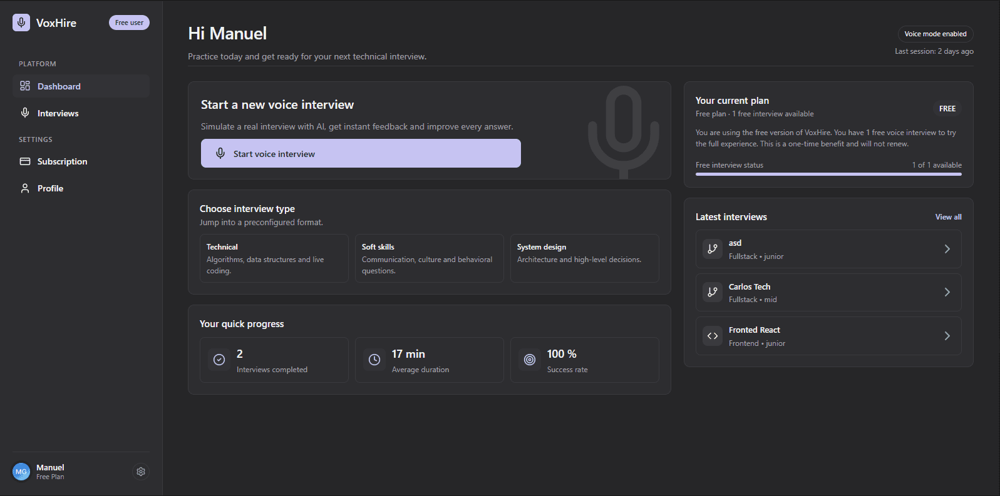

# K4sum3i — Portfolio

Portfolio personal construido con Next.js (App Router) para mostrar proyectos, stack y experiencia.

- Demo: https://k4sum3i.com
- Repositorio: https://github.com/K4sum3i/k4sum3i.dev

## Características

- Página principal con secciones (Hero, About, Projects)
- Listado de proyectos y detalle por slug (`/projects/[slug]`)
- Navegación responsive (isla flotante en desktop + menú móvil)
- UI moderna con Tailwind CSS + componentes estilo shadcn/ui
- Assets optimizados y servidos desde `/public`

## Instalación y configuración

**Requisitos**

- Node.js 20+ recomendado
- npm 10+ (o tu gestor preferido)

**Instalación**

```bash
npm ci
```

**Desarrollo**

```bash
npm run dev
```

Abre http://localhost:3000

## Uso

- Home: `/`
- Proyectos: `/projects`
- Detalle de proyecto: `/projects/<slug>` (slugs definidos en `data/data.ts`)

Scripts útiles:

```bash
npm run build
npm run start
npm run lint
```

## Capturas

Puedes usar estas imágenes del propio repositorio como preview:

- `public/voxhire/dashboard.webp`
- `public/itinerum/index.webp`

Ejemplo en Markdown:

```md

```

## Stack tecnológico

- Framework: Next.js
- UI: React + TypeScript
- Estilos: Tailwind CSS
- Componentes: Radix UI + shadcn/ui
- Animación: Motion
- Iconos: lucide-react

## Contribuir

Si quieres proponer mejoras:

1. Haz un fork del repositorio
2. Crea una rama: `git checkout -b feat/mi-mejora`
3. Haz commit con cambios claros
4. Abre un Pull Request describiendo el objetivo y el impacto

## Licencia

Este repositorio no incluye un archivo de licencia actualmente. Si planeas abrir el código, añade una licencia (por ejemplo MIT) y actualiza esta sección.

## Contacto

- Email: mailto:manugg24@proton.me
- LinkedIn: https://www.linkedin.com/in/k4sum3i/
- GitHub: https://github.com/K4sum3i
